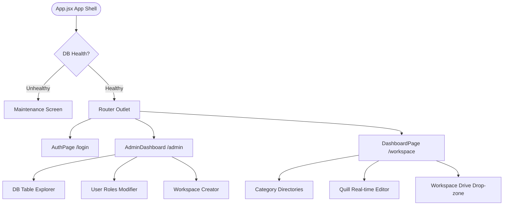

# SyncPad Frontend (Shared Real-time Workspace Clipboard)

> [!IMPORTANT]
> **Core Mission:** SyncPad is a web-based, real-time shared clipboard that allows collaborative text editing, category organization, file sharing, and roles management. It features a collaborative locking engine so only one user session can edit the live sheet at a time, protecting work, alongside an integrated workspace file sharing drive.

<p align="center">
  <strong>Real-time WS Sync</strong> &bull;
  <strong>Collaborative Locking</strong> &bull;
  <strong>Workspace File Drive</strong> &bull;
  <strong>Admin DB Explorer</strong>
</p>

<p align="center">
  <strong>Live Production URL:</strong> <a href="https://projects.satishg.in/syncpad" target="_blank">projects.satishg.in/syncpad</a>
</p>

<p align="center">
  Looking for the backend repository? Check out the <a href="https://github.com/09satishgs/sync-pad-backend/blob/master/README.md">SyncPad Backend README</a> for database configuration and WebSocket server technical details.
</p>

---

## Table of Contents

- [Why This Project Exists](#why-this-project-exists)
- [Who This README Is For](#who-this-readme-is-for)
- [Product Snapshot](#product-snapshot)
- [Feature Overview](#feature-overview)
- [Significant Changes & Quality of Life (QoL) Updates](#significant-changes--quality-of-life-qol-updates)
- [How The System Works (Technical Architecture)](#how-the-system-works-technical-architecture)
- [Application Features Tree](#application-features-tree)
- [Example Use Case: Live Clipboard Collaboration](#example-use-case-live-clipboard-collaboration)
- [Local Development](#local-development)
- [Tech Stack](#tech-stack)

---

## Why This Project Exists

### The Problem

Traditional copy-paste and text sharing across devices or team members is fragmented. Standard clipboard utilities are single-user and local. Sending text snippet files via messaging apps or email is clunky, lacks structure, and does not support real-time synchronization or concurrent-edit locking, leading to users overwriting each other's edits unintentionally.

### The Solution

SyncPad provides workspace-scoped live clipboards where teams can collaborate in real-time. With auto-save, lock ownership rules, category directories, and drag-and-drop file sharing, users can sync scripts, keys, configuration files, and snippets instantly and securely.

- **Workspace Snappiness:** Real-time editing synchronizes typing updates instantly across all active users in a workspace via WebSockets.
- **Locking Safety:** Prevents concurrent edit conflicts by giving one writer full control of the live sheet, making other views read-only.
- **Zero-Markup Loss:** Manual and automatic archives are saved as `.txt` files containing raw HTML markup, fully preserving text styles, bold, italic, and lists.

---

## Who This README Is For

| Audience                   | Start Here                                                           | Why                                                                          |
| -------------------------- | -------------------------------------------------------------------- | ---------------------------------------------------------------------------- |
| **End Users**              | [Product Snapshot](#product-snapshot)                                | Understand workspace capabilities, categories, and file sharing features.    |
| **Developers / Reviewers** | [How The System Works](#how-the-system-works-technical-architecture) | Inspect the logic separation hooks, connection listeners, and socket states. |
| **Contributors**           | [Local Development](#local-development)                              | Quick start to clone, install node packages, and run local development.      |

---

## Product Snapshot

### What users can do

| Area / Module         | What it offers / Core Capabilities                                                                                                                                                                                                                                                             |
| --------------------- | ---------------------------------------------------------------------------------------------------------------------------------------------------------------------------------------------------------------------------------------------------------------------------------------------- |
| **Welcome & Landing** | - Authenticates user credentials.<br />- Synchronizes workspace authorizations upon click via the `Sync Roles` button.<br />- Bypasses landing views to direct Admins automatically to the database dashboard.                                                                                 |
| **Sidebar Directory** | - Selects active workspaces.<br />- Organizes sheets inside collapsible folders (categories).<br />- Features shortcut `+` buttons to add a sheet directly under a category.                                                                                                                   |
| **Quill Rich Editor** | - Synchronizes text editing reactively.<br />- Shows `🟢 Editing` badge to the lock owner.<br />- Hides formatting toolbars and shows `🔒 Read-Only` status for locked devices, featuring a **[Take Control]** takeover action.                                                                |
| **Workspace Drive**   | - Drag-and-drop file sharing container.<br />- Displays uploaded file lists with size, date, uploader, and quick download/delete actions.                                                                                                                                                      |
| **Admin Dashboard**   | - **DB Explorer**: Evaluates sqlite schema tables via dynamically sized grids with LIMIT offset paginations.<br />- **Users & Roles**: Lists users, decodes permissions, and saves workspace role access overrides.<br />- **Workspaces Manager**: Creates workspaces and manages memberships. |

### Key Interactions & UX Highlights

- **Startup Health Shield**: Blocks UI routing on launch and presents a maintenance banner if the SQLite database is down or unhealthy.
- **Micro-Animations**: Uses rotating gear SVG animations and pulsing badges to indicate lock status and load-state transitions.
- **Autofocus Fixers**: Synchronizes remote DOM updates using reference keys, preserving scroll state and cursor selections when remote edits are applied.

---

## Feature Overview

### Collaborative Locking & Syncing

| Element / Action    | Trigger / Event                | UI Reaction / Effect                                                      | Configuration |
| ------------------- | ------------------------------ | ------------------------------------------------------------------------- | ------------- |
| **Lock Assignment** | Entering the `Live` tab        | Broadcasts `sheet_lock_status` to room; assigns lock to first visitor     | Automatic     |
| **Takeover**        | Clicking `[Take Control]`      | Prompts user confirm dialog; requests editing lock transfer to backend    | User Action   |
| **Relinquish**      | Switching tabs or closing page | Emits `client_viewing_sheet` for other tab; transfers lock to next viewer | Automatic     |
| **Lock Reactivity** | Reconnect / disconnect         | Re-evaluates lock ownership using reactive connection `socketId` state    | Automatic     |

### Workspace Drive (File Sharing)

| Tool / Capability       | Implementation Details                                                     | User Action                          |
| ----------------------- | -------------------------------------------------------------------------- | ------------------------------------ |
| **Drag & Drop Zone**    | HTML5 dragover/drop handlers triggering FormData uploads to backend        | Drag any file into sidebar drop-zone |
| **Dynamic Re-indexing** | WebSocket notifies other viewers to trigger file listing updates instantly | Automatic on upload/deletion         |
| **Binary Streamer**     | Triggers workspace-scoped download endpoints in new browser viewports      | Click the download arrow icon (`⬇️`) |

---

## How The System Works (Technical Architecture)

```
                       +----------------------------------+
                       |           App.jsx                |
                       |  (Initial DB Health Check Check) |
                       +-----------------+----------------+
                                         | (Healthy)
                                         v
                       +-----------------+----------------+
                       |          AuthProvider            |
                       |  (User & Session Context Sync)   |
                       +-----------------+----------------+
                                         |
                                         v
                       +-----------------+----------------+
                       |         SocketProvider           |
                       | (Multiplexed /syncpad Namespace) |
                       +--------+----------------+--------+
                                |                |
                                v                v
                     +----------+---+        +---+----------+
                     | DashboardPage|        |AdminDashboard|
                     |  (/workspace) |        |   (/admin)   |
                     +--------------+        +--------------+
```

### 1. Multiplexed WebSocket Namespace Connections

The application connects to the backend socket server using the `/syncpad` namespace (provided by `VITE_WS_URL`). Sockets are multiplexed to allow simultaneous notifications and live updates. The connection state (`socketId`) is tracked reactively inside the dashboard page hook:

```javascript
useEffect(() => {
  if (!socket) return;
  const handleConnect = () => setSocketId(socket.id);
  const handleDisconnect = () => setSocketId(null);

  if (socket.connected) {
    setSocketId(socket.id);
  }
  socket.on("connect", handleConnect);
  socket.on("disconnect", handleDisconnect);
  return () => {
    socket.off("connect", handleConnect);
    socket.off("disconnect", handleDisconnect);
  };
}, [socket]);
```

### 2. Startup Health Check

On app launch, a startup health check fetches system health. If unhealthy, a maintenance target timestamp is calculated dynamically:

```javascript
const getExpectedCompletionTime = () => {
  const now = new Date();
  const year = now.getUTCFullYear();
  const month = now.getUTCMonth();
  const date = now.getUTCDate();

  // Tomorrow at 12:00:00 UTC
  const targetDate = new Date(Date.UTC(year, month, date + 1, 12, 0, 0));

  const pad = (num) => String(num).padStart(2, "0");
  const yyyy = targetDate.getUTCFullYear();
  const mm = pad(targetDate.getUTCMonth() + 1);
  const dd = pad(targetDate.getUTCDate());

  return `${yyyy}-${mm}-${dd} 12:00:00 PM UTC`;
};
```

---

## Application Features Tree



---

## Example Use Case: Live Clipboard Collaboration

### Step 1: Connecting and Joining the Room

1. User 1 logs in and selects the `Engineering` workspace.
2. The frontend connects to the `/syncpad` socket namespace and joins the room `sheet_1`.
3. Since User 1 is the first viewer, the server assigns User 1 the lock, broadcasting `sheet_lock_status` with `lockedBySocketId` matching User 1.
4. User 1's editor is unlocked and displays `🟢 Editing`.

### Step 2: Second User Joins (Read-Only Lockout)

1. User 2 logs in, selects the same workspace, and joins `sheet_1`.
2. The server detects that User 1 holds the lock, and returns the lock status to User 2.
3. User 2's frontend evaluates `lockedBySocketId !== socketId` as `true`.
4. User 2's editor is set to `readOnly={true}`, disabling the rich text toolbar and displaying `🔒 Read-Only`.

### Step 3: Takeover and Editing Transmission

1. User 2 clicks `[Take Control]` and confirms.
2. The frontend emits `client_take_control_sheet` to the backend.
3. The server updates the lock mapping to User 2's socket ID and broadcasts the updated status.
4. User 2's editor unlocks (`🟢 Editing`), and User 1's editor instantly locks (`🔒 Read-Only`).
5. As User 2 types, edits are debounced and emitted to the server via `client_edit_sheet`.
6. Other active clients in the room receive the `server_sheet_content_updated` event to sync their views.

---

## Local Development

### Prerequisites

- Node.js 18+
- npm (Node Package Manager)

### Setup Instructions

1. **Clone the repository and install dependencies:**

   ```bash
   npm install
   ```

2. **Configure Environment Variables:**
   Create a `.env` file in the root folder (or copy `.env.example`):

   ```bash
   # API Base Path and Websocket URLs
   VITE_API_URL=http://localhost:5000/syncpad
   VITE_WS_URL=http://localhost:5000/syncpad
   ```

3. **Run local development server:**

   ```bash
   npm run dev
   ```

   _The server runs locally at: `http://localhost:5173/`_

4. **Compile production bundle:**

   ```bash
   npm run build
   ```

5. **Run production preview locally:**

   ```bash
   npm start
   ```

   _Serves the production build compiled in `/dist` on local preview port._

6. **Run dev server using production environment settings:**
   ```bash
   npm run dev:prod
   ```

---

## Tech Stack

| Layer / Role            | Technology         | Purpose                                                                          |
| ----------------------- | ------------------ | -------------------------------------------------------------------------------- |
| **Framework & Bundler** | React 19, Vite 8   | Serves as the core reactive UI framework and optimized project packager.         |
| **Routing**             | React Router Dom 7 | Manages page routing via `HashRouter` for workspace, admin, and login paths.     |
| **Styling & Theming**   | Vanilla CSS        | Provides complete layout style customization, grid structures, and animations.   |
| **Real-time Syncing**   | Socket.io Client 4 | Connects multiplexed namespaces and transmits keystroke buffers and file events. |
| **Editor Canvas**       | React Quill New 3  | Renders the rich-text input buffer editor.                                       |
| **REST API Client**     | Axios 1            | Issues HTTP requests, cookie tokens, and workspace upload payloads.              |
